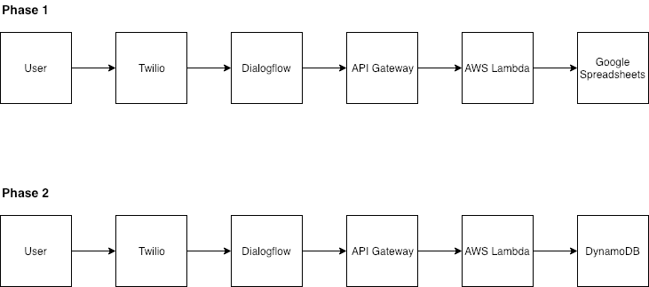

# RSVPER

Rsvper facilitates makeing and collecting RSVPs via text messages and (in the future) phone calls.

## Setup
### Install
1. `brew install awscli`
3. `pip install --user aws-sam-cli`
4. `npm install -g --upgrade aws-sam-local`
5. `npm install`
5. `git clone` repo
6. `cd` into repo and run `npm install`
7. `serverless sam export --output ./template.yml` to create a sam template. 

### Local Development
8. `sam local start-api` to start local instance of API Gateway. Note: your lambda logs will appear here. This should start the API Gateway on port 3000
9.  Run `ssh -R rsvper.serveo.net:80:localhost:3000 serveo.net`
11. What to restart after updating specific sections:
    - Update lambda function -> Run `make build` Don't restart sam-local because it uses "hot reloading" (so, files are updated without losing the app's state).
    - Update secrets -> (Make sure to encrypt/decrypt as needed) Run `serverless sam export --output ./template.yml` & Restart `sam local start-api`
    - Update serverless configs -> Restart `sam local start-api`

12. For testing:
    - Function Integration Test -> 
        - add google api creds to the `Makefile`
        - run `make test`
        - replace `<insert google api creds>` with creds from another developer (*Correction* for now you will have to `export` those creds (gotten from a developer) into your env variables)
    - (Mock) Deployment -> 
        - `serverless deploy --nodeploy` to regernate the rsvper.zip that sam-local uses.
    - Local End-to-End Test -> 
        - run `sam local start-api`
        - run `ssh -R rsvper.serveo.net:80:localhost:3000 serveo.net`
        - you shouldn't have to update the webhook url as the subdomain used by serveo.net will always be the same, but if you do need to: Copy & paste the `https://<forwarding-url>/hello` (forwarding-url printed on the terminal) into the [dialogflow fulfillment webhook](https://console.dialogflow.com/api-client/#/agent/a637c45e-9770-4fcc-acc7-8821de730eaa/fulfillment) -- Remember to press the `Save` button at the bottom of the page
        - import and run `POST Fulfillment Request for RSVP...` from the postman collection in `docs/`
### Prod Deployment
- `serverless deploy` (make sure you have the correct default creds in your `~/.aws/credentials`)
- to completely redeploy the entire stack and not just update the lambda function code:
    - delete the cloud formation stack (you may have to delete the s3 bucket first)
    - `serverless deploy`
### Additional Config
- Encrypt creds: `serverless encrypt --stage dev --password <password>`
- Decrypt creds: `serverless dncrypt --stage dev --password <password>`
- if you need to switch to `ngrok` insteady of `serveo.net`:
    - `brew install ngrok`
    - `ngrok http 3000`
    - update the dialogflow webhook url with the newly generated ngrok forwarding url

## Architecture
### App Diagram

## TODO
- Dockerize app
- Add end of conversation message (after they've rsvp'ed to all the events they've been invited to)
- Allow users to skip specific rsvps
- Allow users to update specific even rsvps (instead of going through the welcome flow)
- Allow users to reset their conversation (by deleting all their contexts)

## Database Structure
### INVITED_FAMILY
#### Origin 
- (informal) where the family is from
- string
- col A
#### Name 
- (informal) name used by Rajeshri
- string
- col B
#### Invite Name 
- name displayed on invite
- string
- col C
#### Invite Code 
- unique code to distinguish invited families
- number
- col D
#### Vidhi-Invite 
- number of people invited to the vidhi on the invitation card (`ALL` means unlimited, `NULL` means no value yet)
- string/number
- col E
#### Vidhi-RSVP'd 
- latest number rsvp'd by the invited family for the vidhi (`NULL` means no value yet)
- strin/number
- col F
#### Garba-Invite 
- number of people invited to the garba on the invitation card (`ALL` means unlimited, `NULL` means no value yet)
- string/number
- col G
#### Garba-RSVP'd 
- latest number rsvp'd by the invited family for the garba (`NULL` means no value yet)
- string/number
- col H
#### Wedding-Invite 
- number of people invited to the wedding on the invitation card (`ALL` means unlimited, `NULL` means no value yet)
- string/number
- col I
#### Wedding-RSVP'd 
- latest number rsvp'd by the invited family for the wedding (`NULL` means no value yet)
- string/number
- col J

** Note needed to add `NULL` to number columns because the golang google sheets lib automatically omits empty values **

### UPDATE_EVENT
#### Invite Code 
- used to connect the event to the invited family
- number
- col A
#### Phone Number 
- phone number used to make the rsvp update
- string
- col B
#### Event
- vidhi, garba, or wedding
- string (enum)
- col C
#### Number Attending 
- number of invitees atting the event
- number
- col D
#### Timestamp 
- time this rsvp update was made
- number
- col E

## Useful Docs
- [AWS SAM - Running API Gateway Locally](https://docs.aws.amazon.com/serverless-application-model/latest/developerguide/serverless-sam-cli-using-start-api.html)
- [Dialogflow - Configure Fulfillment](https://dialogflow.com/docs/fulfillment/configure)
- [Dialogflow - Overview](https://dialogflow.com/docs/sdks#fulfillment)
- [AWS SAM - serverless to SAM converter](https://www.npmjs.com/package/serverless-sam)
- [AWS SAM - Installation](https://docs.aws.amazon.com/serverless-application-model/latest/developerguide/serverless-sam-cli-install.html)
- [Dialogflow with Google API Fulfillment](https://dialogflow.com/docs/tutorial-build-an-agent/create-fulfillment-using-webhook)
- [Dialogflow Go Docs](https://godoc.org/google.golang.org/genproto/googleapis/cloud/dialogflow/v2)
### Google Sheets
- [Golang Google Auth Docs](https://godoc.org/golang.org/x/oauth2/google)
#### APIs
- [Get Data](https://developers.google.com/sheets/api/reference/rest/v4/spreadsheets.values/get)
- [Append Data](https://developers.google.com/sheets/api/reference/rest/v4/spreadsheets.values/append)
- [Batch Update Data](https://developers.google.com/sheets/api/reference/rest/v4/spreadsheets.values/batchUpdate)
### Github
- [Removing Submodules](https://stackoverflow.com/questions/1260748/how-do-i-remove-a-submodule)
- [Removing .DS_Store](https://stackoverflow.com/questions/18393498/gitignore-all-the-ds-store-files-in-every-folder-and-subfolder)
### Go
- [Stack Traces](https://www.ardanlabs.com/blog/2015/01/stack-traces-in-go.html)